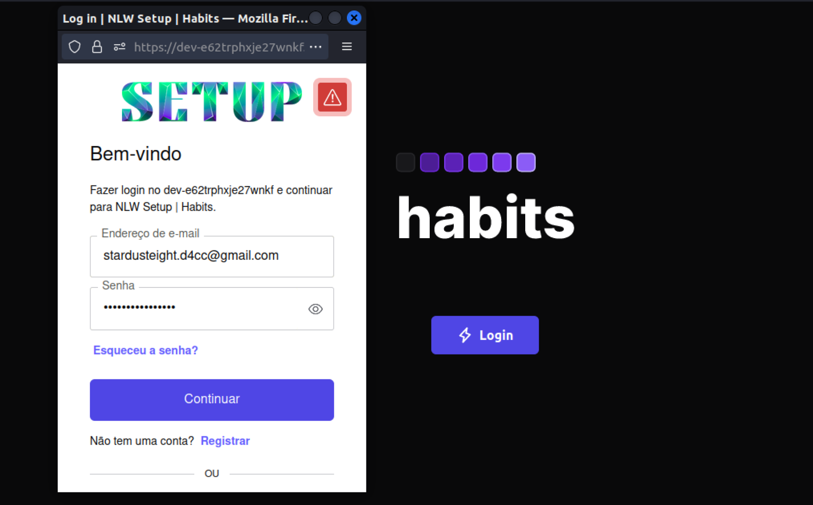

# NLW Setup | Dates and Web Push API Notifications


> Application built at the `Rocketseat (Next Level Week | Setup)` event, where we developed a `Habit Tracker` where the user can create an account
> and thus define and manage habits to be carried out on certain days of the week, mark them as completed or not, thus making
> the user habits dashboard or table molds itself over time. For this we deal with the `manipulation of dates and time` in both the frontend and the
> backend. In addition we use the `Push API` which gives web applications the ability to receive notifications sent to them from a server, whether
> the web application in the foreground or not, or even currently loaded, in a user agent. This allows developers to provide
> `asynchronous notifications and updates to opt-in users`, resulting in better engagement with timely new content.

:arrow_right: Working with Dates | Date constructor, Unix time, Intl and libraries <br /> 
:arrow_right: Auth0 Authentication <br /> 
:arrow_right: Services Workers <br /> 
:arrow_right: Web Push API Notifications <br /> 

<br />

## Working with Dates | Date constructor, Unix time, Intl and libraries 

It is now common sense that `Brendan Eich` had 10 days to write what would become known as `JavaScript` and include it in the now deceased `Netscape browser`.

`Date manipulation is a very important part of any programming language`, none can be released (or even be considered complete) without having something to deal with the most common thing we have in everyday life, time. Eich relied on the instruction `"It should look like Java"`, which he was given to build the language, and copied the already bad java.Util.Date API, and it was practically all rewritten in Java 1.1, this 24 years ago.

Today, in 2021, we have JavaScript code from legacy applications from the 90's being served across the web, and while this can be a commendable thing, it is extremely worrying, because any changes must be thought out very carefully, and old APIs such as Date , cannot simply be depreciated.

### Epoch time, Unix epoch or Unix time — How to represent time in an universal format?

 - <strong>Answer</strong>: As a `number`

The `UNIX Era or Posix Time or Unix epoch or Unix Timestamp` began on `January 1, 1970`. The name is due to the fact that this date, January 1, 1970 at 00:00:00 Coordinated Universal Time in the proleptic Gregorian calendar, `is ground zero of the calendar system used by the UNIX operating system`.

 - `Ex.: 1675167732`

#### Motivation

Despite the Gregorian calendar facilitating chronological reasoning for humans, when you want to carry out `logical comparisons or calculations with dates on computers`, this type of calendar ends up making the work difficult.

For example, for us, knowing what happened first, if it was something at `10/04/1977 12:45:15 or something at 10/03/1976 13:09:12` is almost automatic but to solve this in a computer all 6 fields would have to be analyzed independently, although this is done almost instantly it is still an extra work that the processor could avoid using another date format. `Let's imagine a database with thousands of records and the processor receiving a command to put everything in chronological order`, if we can make the comparisons with a single operation per record instead of 6 operations/record the final time will also tend to be 6 times smaller.

Another situation would be: `How much does the date 09/16/2004 23:59:58 UTC give plus 12 days, 10 hours and 40 minutes?` The complication in this type of calculation lies in correcting the overflow as the processing in stages is carried out . That is, when adding the 40 minutes to the date we would have 99 minutes, before adding the 10 hours we would need to correct this value, so the minute would be 39 and the hour would add 1, but 24 hours also needs to be corrected to 0 which would add 1 to the day, resulting in 09/17/2004 0:39:58, only then would we add the 10 hours, make the corrections, add the days and again make corrections. It is easily seen that this is repetitive work that should be avoided.

*<i>en.wikipedia.org/wiki/Unix_time</i> <br />

In Nodejs, `dateNow` is a number and is in Unix Epoch.

```ts
let dateNow = Date.now();
console.log(dateNow) // 1675168342973
```

```ts
async summary(request: FastifyRequest) {
  const summaryQueryString = z.object({
    user_id: z.string().uuid(),
  });

  try {
    const { user_id } = summaryQueryString.parse(request.query);
    const summary = await prisma.$queryRaw`
    SELECT D.id, D.date,
    (SELECT cast(count(*) as float) 
      FROM day_habits DH
      WHERE DH.day_id = D.id 
    ) as completed,
    (SELECT cast(count(*) as float)
      FROM habit_week_days HWD
      JOIN habits H
      ON H.id = HWD.habit_id 
      WHERE HWD.week_day = cast(strftime('%w', D.date/1000.0, 'unixepoch') as int) 
      AND H.created_at <= D.date
      AND H.userId = ${user_id}
    ) as amount
    FROM days D 
    WHERE userId = ${user_id}
    `;
    return summary;
  } catch (error) {
    console.log(error);
    return error;
  }
}
```

### Intl | ECMAScript Internationalization API and toLocaleDateString

The `Intl.DateTimeFormat object` enables language-sensitive date and time formatting.

#### Intl

```ts
const date = new Date("2023-01-31 00:00")
console.log(new Intl.DateTimeFormat("pt-br").format(date))
// 31/01/2023
```

```ts
const date = new Date("2023-01-31 00:00")
console.log(new Intl.DateTimeFormat("pt-br", {
 dateStyle: "full", timeStyle: "long"
}).format(date))
// terça-feira, 31 de janeiro de 2023 00:00:00 BRT
```

#### toLocaleDateString

The `toLocaleDateString()` method returns a string with a language-sensitive representation of the date portion of the specified date in the user agent's timezone. In implementations with `Intl.DateTimeFormat API support, this method simply calls Intl.DateTimeFormat`.

```ts
const date = new Date("2023-01-31 00:00")
// node -p 'new Date("2023-01-31 00:00")'
// 2023-01-31T03:00:00.000z

const options = {
  year: "numeric",
  month: "long",
  day: "numeric"
}
date.toLocaleDateString("pt-br", options)
// console.log(date.toLocaleDateString("pt-br", options))
// 31 de janeiro de 2023
```
*<i>developer.mozilla.org</i> <br />

<br />

## Auth0 Authentication 

`Reduce costs and risks that come with building your own solution`. A flexible solution that plugs into any application written in any language. Auth0 lets you quickly add authentication to your React app and gain access to user profile information. We will now see how to integrate `Auth0` with any React application using the Auth0 React SDK (Software Development Kit).

### On the platform

#### Get Your Application Keys 

When you signed up for Auth0, a new application was created for you, or you could have created a new one. You will need some details about that application to communicate with Auth0. You can get these details from the Application Settings section in the Auth0 dashboard.

You need the following information:

 - Domain
 - Client ID

#### Configure Callback URLs

A `callback URL is a URL in your application where Auth0 redirects the user after they have authenticated`. The callback URL for your app must be added to the Allowed Callback URLs field in your Application Settings. If this field is not set, users will be unable to log in to the application and will get an error.

#### Configure Allowed Web Origins

You need to add the URL for your app to the `Allowed Web Origins` field in your Application Settings. If you don't register your application URL here, the application will be unable to silently refresh the authentication tokens and your users will be logged out the next time they visit the application, or refresh the page.

### In code

#### Install the Auth0 React SDK

Run the following command within your project directory to install the `Auth0 React SDK`:

 - `npm install @auth0/auth0-react`

#### Configure the Auth0Provider component

Under the hood, the Auth0 React SDK uses React Context to manage the authentication state of your users. `One way to integrate Auth0 with your React app is to wrap your root component with an Auth0Provider that you can import from the SDK`.

```tsx
// src/main.tsx

ReactDOM.createRoot(document.getElementById('root') as HTMLElement).render(
  <React.StrictMode>
    <RecoilRoot>
      <Auth0Provider
        domain={import.meta.env.VITE_AUTH0_DOMAIN}
        clientId={import.meta.env.VITE_AUTH0_CLIENT_ID}
        authorizationParams={{
          redirect_uri: window.location.origin,
        }}
        cacheLocation="localstorage"
      >
        <App />
      </Auth0Provider>
    </RecoilRoot>
  </React.StrictMode>
)
```

#### Add Login to Your Application

The `Auth0 React SDK` gives you tools to quickly implement user authentication in your React application, such as creating a login button using the `loginWithRedirect()` method from the `useAuth0()` hook. Executing `loginWithRedirect()` redirects your users to the Auth0 Universal Login Page, where Auth0 can authenticate them. Upon successful authentication, Auth0 will redirect your users back to your application.

```tsx
// src/components/login/integrate/LoginButton.tsx

import { useAuth0 } from '@auth0/auth0-react'
import { useRecoilState } from 'recoil'
import { currentUserState } from '../../../atoms'
import { api } from '../../../lib/axios'
import { Lightning } from 'phosphor-react'

export const LoginButton = () => {
  const { loginWithPopup, user } = useAuth0()
  const [currentUser, setCurrentUser] = useRecoilState(currentUserState)
  const notAuthenticated = user?.email && currentUser.email === ''

  if (notAuthenticated) {
    api
      .post('/auth/login', {
        email: user.email,
        picture: user.picture,
      })
      .then((res) => {
        setCurrentUser({
          id: res.data.user.id,
          email: res.data.user.email,
          picture: res.data.user.picture,
        })
        localStorage.setItem('session', res.data.sessionToken)
      })
  }

  return (
    <button
      type="button"
      onClick={() => loginWithPopup()}
      className={style.wrapper}
    >
      <Lightning weight="bold" size={20} />
      Login
    </button>
  )
}
```

#### Add Logout to Your Application

Now that you can log in to your React application, you need a way to log out. You can create a logout button using the `logout()` method from the `useAuth0()` hook. Executing logout() redirects your users to your Auth0 logout endpoint (https://YOUR_DOMAIN/v2/logout) and then immediately redirects them to your application.

```tsx
// src/components/LogoutButton.tsx

import React from 'react'
import { useAuth0 } from '@auth0/auth0-react'
import { LightningSlash, SignOut } from 'phosphor-react'
import { useRecoilState } from 'recoil'
import { currentUserState } from '../atoms'

interface Props {
  setLoading: React.Dispatch<React.SetStateAction<boolean>>
}

export const LogoutButton = ({ setLoading }: Props) => {
  const { logout } = useAuth0()
  const [_, setCurrentUser] = useRecoilState(currentUserState)

  return (
    <button
      onClick={() => {
        setLoading(true)
        localStorage.removeItem('session')
        setCurrentUser({
          id: '',
          email: '',
          picture: '',
        })
        logout()
      }}
      type="button"
      className={style.wrapper}
    >
      <LightningSlash weight="bold" size={20} />
      Logout
    </button>
  )
}
```
*<i>manage.auth0.com/dashboard/us/dev-e62trphxje27wnkf/applications/EMdCnQWNmsjY1eg8vJEsEhFxIFE57Mqo/quickstart</i> <br />

<div align="center">

</div>


